Patrones de Diseño

CATEGORÍA: CREACIONAL

Factory Method: Define una interfaz para crear un objeto, pero deja que las subclases decidan qué clase instanciar. Permite delegar la lógica de creación.
```java
abstract class Logistica {
    public abstract Transporte crearTransporte();
}

class LogisticaMaritima extends Logistica {
    public Transporte crearTransporte() { return new Barco(); }
}
```
```python
class Logistica:
    def crear_transporte(self):
        raise NotImplementedError()

class LogisticaMaritima(Logistica):
    def crear_transporte(self):
        return Barco()
```
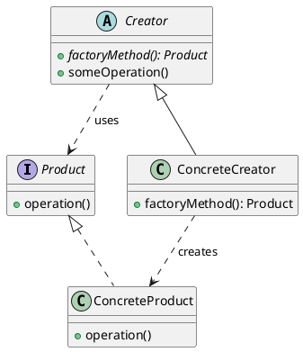

Abstract Factory: Proporciona una interfaz para crear familias de objetos relacionados o dependientes sin especificar sus clases concretas. Asegura la compatibilidad entre productos.
```java
interface FabricaMuebles {
    Silla crearSilla();
    Mesa crearMesa();
}

class FabricaModerna implements FabricaMuebles {
    public Silla crearSilla() { return new SillaModerna(); }
    public Mesa crearMesa() { return new MesaModerna(); }
}
```
```python
class FabricaMuebles:
    def crear_silla(self): pass
    def crear_mesa(self): pass

class FabricaModerna(FabricaMuebles):
    def crear_silla(self): return SillaModerna()
    def crear_mesa(self): return MesaModerna()
```
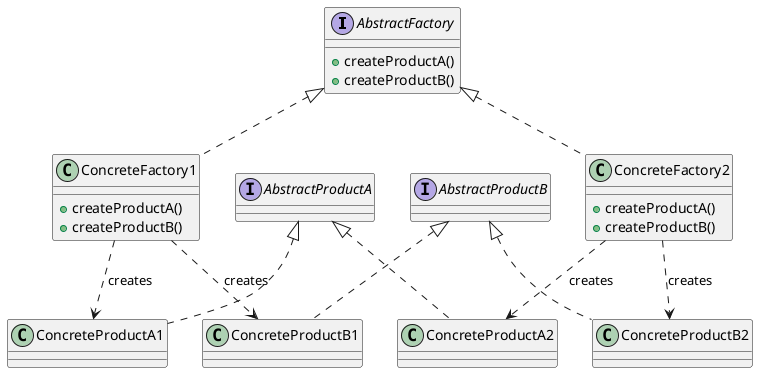
Builder: Separa la construcción de un objeto complejo de su representación, permitiendo crear diferentes variaciones del mismo objeto usando el mismo proceso paso a paso.
```java
Pizza pizza = new PizzaBuilder()
    .setMasa("Delgada")
    .setSalsa("Tomate")
    .setExtraQueso(true)
    .build();
```
```python
pizza = PizzaBuilder() \
    .set_masa("Delgada") \
    .set_salsa("Tomate") \
    .set_extra_queso(True) \
    .build()
```
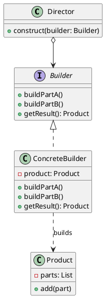
Prototype: Permite copiar objetos existentes sin que el código dependa de sus clases, utilizando una instancia "prototipo" para generar nuevos objetos mediante clonación.
```java
// En Java se suele usar la interfaz Cloneable
class Oveja implements Cloneable {
    public Oveja clone() throws CloneNotSupportedException {
        return (Oveja) super.clone();
    }
}
```
```python
import copy

class Oveja:
    def clone(self):
        return copy.deepcopy(self)
```
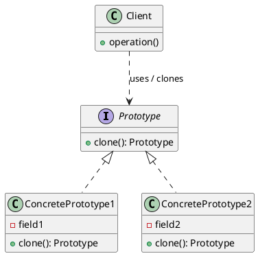

Singleton: El patrón se manifiesta como un Control de Instancia Única basado en Estado Global. Se utiliza una variable global (phishing_process) como recurso compartido para asegurar que solo un subproceso de ataque esté activo simultáneamente.
```python
# Línea 8:
phishing_process = None 

# Línea 38 (dentro de launch_phishing):
global phishing_process

# Líneas 40-41:
if phishing_process:
    phishing_process.terminate()

# Línea 45:
phishing_process = subprocess.Popen(...)
```
```java
import java.io.IOException;

public class ProcessManager {

    private static Process phishingProcess = null;

    public static void launchPhishing() {
        if (phishingProcess != null) {
            phishingProcess.destroy();
        }

        try {
            ProcessBuilder builder = new ProcessBuilder("comando", "argumentos");
            phishingProcess = builder.start();
        } catch (IOException e) {
            e.printStackTrace();
        }
    }
}
```
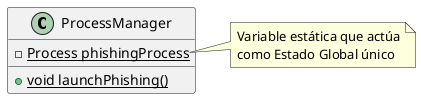
CATEGORIA: ESTRUCTURAL

Adapter: Actúa como un envoltorio que traduce las llamadas de tu sistema a la librería externa playwright, permitiendo cambiar de herramienta de automatización sin reescribir la lógica principal del validador.
```python
class PlaywrightAdapter:
    def validar(self, email, password):
        # Adapta la interfaz compleja de Playwright a un método simple
        with sync_playwright() as p:
            # ... lógica interna oculta ...
            return "Success" if login_exitoso else "Fail"

# Uso: El código principal solo ve .validar(), no sabe qué hay dentro
resultado = PlaywrightAdapter().validar("admin", "123")
```
```java
import com.microsoft.playwright.Browser;
import com.microsoft.playwright.Playwright;

public class PlaywrightAdapter {

    public String validar(String email, String password) {
        try (Playwright playwright = Playwright.create()) {
            Browser browser = playwright.chromium().launch();
            
            boolean loginExitoso = false;

            return loginExitoso ? "Success" : "Fail";
        }
    }

    public static void main(String[] args) {
        String resultado = new PlaywrightAdapter().validar("admin", "123");
    }
}

```
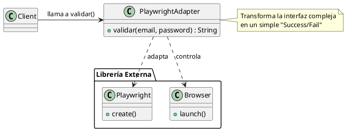
Bridge: Desacopla la acción de "Validar" (Abstracción) de la plataforma específica como Heroku o Facebook (Implementación), permitiendo añadir nuevos sitios objetivo sin modificar la clase que gestiona el proceso de validación.

```python
class Verificador: # Abstracción
    def __init__(self, plataforma): self.plat = plataforma
    def ejecutar(self): return self.plat.conectar() # Puente

class HerokuImp: # Implementación Concreta A
    def conectar(self): return "Conectando a Heroku..."

# Uso: Inyectamos la plataforma deseada al crear el objeto
chequeo = Verificador(HerokuImp())
```
```java
interface PlataformaImp {
    String conectar();
}

class HerokuImp implements PlataformaImp {
    public String conectar() {
        return "Conectando a Heroku...";
    }
}

class Verificador {
    private PlataformaImp plat;

    public Verificador(PlataformaImp plataforma) {
        this.plat = plataforma;
    }

    public String ejecutar() {
        return this.plat.conectar(); // Puente
    }
}

public class Main {
    public static void main(String[] args) {
        Verificador chequeo = new Verificador(new HerokuImp());
        chequeo.ejecutar(); 
    }
}

```
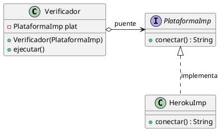
Composite: Organiza las credenciales en una estructura de árbol (jerarquía parte-todo), permitiendo al sistema ejecutar validaciones sobre una credencial individual o sobre una campaña masiva completa usando la misma instrucción de código.

```python
class Campana: # Composite (Grupo)
    def __init__(self): self.lista = []
    def agregar(self, item): self.lista.append(item)
    
    def validar(self):
        # Trata a la lista igual que a un objeto único
        for item in self.lista: item.validar()

# Uso: Ejecuta todo el grupo con una sola llamada
lote = Campana()
lote.agregar(Credencial("user1"))
lote.validar()

```
```java
import java.util.ArrayList;
import java.util.List;

interface Validable {
    void validar();
}

class Credencial implements Validable {
    private String user;

    public Credencial(String user) {
        this.user = user;
    }

    public void validar() {
    }
}

class Campana implements Validable {
    private List<Validable> lista = new ArrayList<>();

    public void agregar(Validable item) {
        this.lista.add(item);
    }

    public void validar() {
        for (Validable item : lista) {
            item.validar();
        }
    }
}

public class Main {
    public static void main(String[] args) {
        Campana lote = new Campana();
        lote.agregar(new Credencial("user1"));
        lote.validar();
    }
}
```
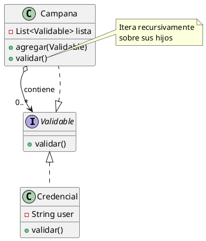
Decorator
Asigna responsabilidades adicionales a un objeto o función dinámicamente, proporcionando una alternativa flexible a la herencia para extender la funcionalidad (como añadir logs o autenticación) sin modificar el código original.
```python
def log_decorator(func):
    def wrapper(*args, **kwargs):
        print(f"[LOG] Ejecutando: {func.__name__}")
        return func(*args, **kwargs) # Ejecuta la original
    return wrapper

@log_decorator
def lanzar_ataque(target):
    print(f"Atacando a {target}")

# Uso: Al llamar a la función, se ejecuta automáticamente el log extra
lanzar_ataque("192.168.1.5")
```
```java
// 1. Interfaz funcional
interface Ataque {
    void ejecutar(String target);
}

// 2. Implementación original (función base)
class AtaqueReal implements Ataque {
    @Override
    public void ejecutar(String target) {
        System.out.println("Atacando a " + target);
    }
}

// 3. Decorador (equivalente al log_decorator)
class LogDecorator implements Ataque {
    private Ataque ataque;

    public LogDecorator(Ataque ataque) {
        this.ataque = ataque;
    }

    @Override
    public void ejecutar(String target) {
        System.out.println("[LOG] Ejecutando: ejecutar");
        ataque.ejecutar(target); // ejecuta la original
    }
}

// 4. Uso
public class Main {
    public static void main(String[] args) {
        Ataque ataque = new LogDecorator(new AtaqueReal());
        ataque.ejecutar("192.168.1.5");
    }
}

```
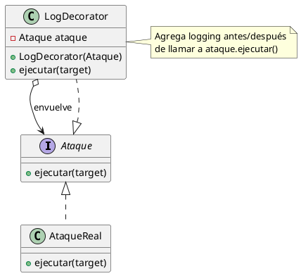
Facade
Proporciona una interfaz unificada y simplificada para un conjunto complejo de subsistemas (como base de datos, red y logs), ocultando la complejidad interna para que el cliente pueda usarlos fácilmente.
```python
class PhishingFacade:
    def __init__(self):
        self.db = DatabaseManager()
        self.net = NetworkSender()
        self.log = LoggerSystem()

    def iniciar_operacion(self):
        # Oculta la complejidad de coordinar 3 sistemas distintos
        self.log.start()
        self.db.connect()
        self.net.send_payload()

# Uso: El cliente solo llama a un método simple
PhishingFacade().iniciar_operacion()
```
```java
// Subsistema 1
class DatabaseManager {
    public void connect() {
        System.out.println("Conectando a la base de datos...");
    }
}

// Subsistema 2
class NetworkSender {
    public void sendPayload() {
        System.out.println("Enviando payload por la red...");
    }
}

// Subsistema 3
class LoggerSystem {
    public void start() {
        System.out.println("Iniciando sistema de logs...");
    }
}

// Facade
class PhishingFacade {
    private DatabaseManager db;
    private NetworkSender net;
    private LoggerSystem log;

    public PhishingFacade() {
        this.db = new DatabaseManager();
        this.net = new NetworkSender();
        this.log = new LoggerSystem();
    }

    public void iniciarOperacion() {
        // Oculta la complejidad de coordinar varios sistemas
        log.start();
        db.connect();
        net.sendPayload();
    }
}

// Uso
public class Main {
    public static void main(String[] args) {
        new PhishingFacade().iniciarOperacion();
    }
}

```
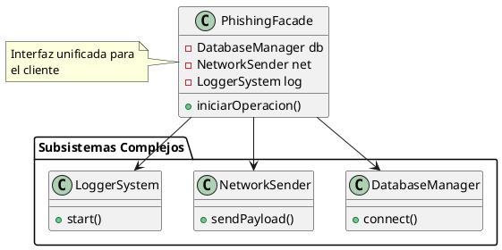
Flyweight
Utiliza el compartimiento para soportar eficientemente grandes cantidades de objetos, extrayendo el estado común (intrínseco) en un solo objeto compartido para ahorrar memoria RAM, manteniendo separado solo el estado único (extrínseco).
```python
class PlantillaEmail: # Estado Intrínseco (Pesado/Compartido)
    def __init__(self, html): self.html = html 
class Envio: # Estado Extrínseco (Único)
    def __init__(self, email, plantilla_compartida):
        self.email = email
        self.plantilla = plantilla_compartida
plantilla_comun = PlantillaEmail("<h1>Hola...</h1>" * 1000)
# Miles de envíos apuntan a la misma plantilla (Ahorro masivo de RAM)
envios = [Envio(f"user{i}@test.com", plantilla_comun) for i in range(10000)]
```
```java
// Estado Intrínseco (Pesado / Compartido)
class PlantillaEmail {
    private String html;

    public PlantillaEmail(String html) {
        this.html = html;
    }

    public String getHtml() {
        return html;
    }
}

// Estado Extrínseco (Único por objeto)
class Envio {
    private String email;
    private PlantillaEmail plantilla;

    public Envio(String email, PlantillaEmail plantillaCompartida) {
        this.email = email;
        this.plantilla = plantillaCompartida;
    }

    public String getEmail() {
        return email;
    }

    public PlantillaEmail getPlantilla() {
        return plantilla;
    }
}

// Uso
public class Main {
    public static void main(String[] args) {

        // Plantilla compartida (una sola en memoria)
        PlantillaEmail plantillaComun =
                new PlantillaEmail("<h1>Hola...</h1>".repeat(1000));

        // Miles de envíos reutilizan la misma plantilla
        Envio[] envios = new Envio[10000];
        for (int i = 0; i < envios.length; i++) {
            envios[i] = new Envio("user" + i + "@test.com", plantillaComun);
        }

        System.out.println("Envios creados: " + envios.length);
    }
}

```
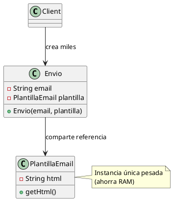
Proxy
Proporciona un sustituto o marcador de posición para controlar el acceso a otro objeto, permitiendo realizar operaciones de seguridad, validación o carga diferida antes de permitir que la solicitud llegue al objeto real.
```python
class RealDatabase:
    def query(self, q): print(f"Ejecutando: {q}")

class SecurityProxy:
    def __init__(self): self.real_db = RealDatabase()

    def query(self, q, user):
        # El Proxy intercepta y verifica permisos antes de dejar pasar
        if user == "admin":
            self.real_db.query(q)
        else:
            print("¡Acceso Denegado!")

# Uso:
proxy = SecurityProxy()
proxy.query("DROP TABLE", "guest") # Bloqueado
proxy.query("SELECT *", "admin")   # Permitido
```
```java
// Sujeto real
class RealDatabase {
    public void query(String q) {
        System.out.println("Ejecutando: " + q);
    }
}

// Proxy de seguridad
class SecurityProxy {
    private RealDatabase realDb;

    public SecurityProxy() {
        this.realDb = new RealDatabase();
    }

    public void query(String q, String user) {
        // El Proxy intercepta y valida permisos
        if ("admin".equals(user)) {
            realDb.query(q);
        } else {
            System.out.println("¡Acceso Denegado!");
        }
    }
}

// Uso
public class Main {
    public static void main(String[] args) {
        SecurityProxy proxy = new SecurityProxy();
        proxy.query("DROP TABLE", "guest"); // Bloqueado
    }
}

```
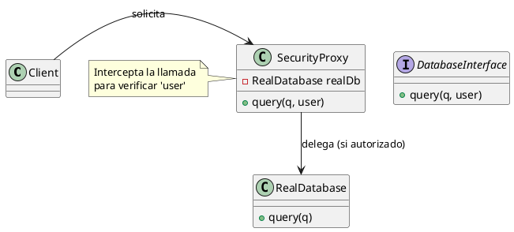

CATEGORIA: COMPORTAMIENTO

Chain of Responsibility (validación / seguridad por capas)

Idea: pasar la “solicitud de login” por una cadena: validar campos → rate limit → sanitizar → registrar intento.

```python
from dataclasses import dataclass
from datetime import datetime
import re

@dataclass
class LoginAttempt:
    email: str
    ip: str
    user_agent: str
    timestamp: str
    status: str = "Pending"
    reason: str = ""

class Handler:
    def __init__(self, next_handler=None):
        self.next = next_handler

    def handle(self, attempt: LoginAttempt) -> LoginAttempt:
        if self.next:
            return self.next.handle(attempt)
        return attempt

class EmailFormatHandler(Handler):
    def handle(self, attempt: LoginAttempt) -> LoginAttempt:
        if not attempt.email or not re.match(r"[^@]+@[^@]+\.[^@]+", attempt.email):
            attempt.status = "Rejected"
            attempt.reason = "Invalid email format"
            return attempt
        return super().handle(attempt)

class BasicRateLimitHandler(Handler):
    # Ejemplo simple: bloquea IPs “marcadas”. En prod usar redis/limiter real.
    BLOCKED_IPS = {"127.0.0.2"}

    def handle(self, attempt: LoginAttempt) -> LoginAttempt:
        if attempt.ip in self.BLOCKED_IPS:
            attempt.status = "Rejected"
            attempt.reason = "Rate limited / blocked IP"
            return attempt
        return super().handle(attempt)

class AuditStampHandler(Handler):
    def handle(self, attempt: LoginAttempt) -> LoginAttempt:
        attempt.timestamp = datetime.utcnow().isoformat()
        attempt.status = "Logged"
        return super().handle(attempt)

# Uso:
chain = EmailFormatHandler(BasicRateLimitHandler(AuditStampHandler()))
```
```java
import java.time.Instant;
import java.util.Set;

class LoginAttempt {
    String email, ip, userAgent, timestamp;
    String status = "Pending";
    String reason = "";

    LoginAttempt(String email, String ip, String userAgent) {
        this.email = email;
        this.ip = ip;
        this.userAgent = userAgent;
    }
}

abstract class Handler {
    protected Handler next;
    public Handler setNext(Handler next) { this.next = next; return next; }
    public abstract LoginAttempt handle(LoginAttempt attempt);

    protected LoginAttempt next(LoginAttempt attempt) {
        return (next != null) ? next.handle(attempt) : attempt;
    }
}

class EmailFormatHandler extends Handler {
    @Override
    public LoginAttempt handle(LoginAttempt attempt) {
        if (attempt.email == null || !attempt.email.matches("^.+@.+\\..+$")) {
            attempt.status = "Rejected";
            attempt.reason = "Invalid email format";
            return attempt;
        }
        return next(attempt);
    }
}

class BlockedIpHandler extends Handler {
    private final Set<String> blockedIps = Set.of("127.0.0.2");

    @Override
    public LoginAttempt handle(LoginAttempt attempt) {
        if (blockedIps.contains(attempt.ip)) {
            attempt.status = "Rejected";
            attempt.reason = "Blocked / rate limited IP";
            return attempt;
        }
        return next(attempt);
    }
}

class AuditStampHandler extends Handler {
    @Override
    public LoginAttempt handle(LoginAttempt attempt) {
        attempt.timestamp = Instant.now().toString();
        if (attempt.status.equals("Pending")) attempt.status = "Logged";
        return next(attempt);
    }
}

// Uso:
// Handler chain = new EmailFormatHandler();
// chain.setNext(new BlockedIpHandler()).setNext(new AuditStampHandler());
// LoginAttempt a = chain.handle(new LoginAttempt("user@mail.com","1.2.3.4","UA"));
```

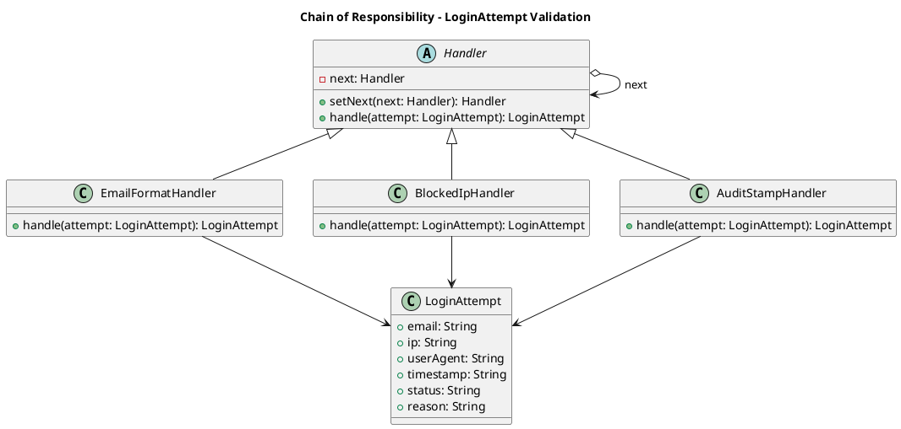

Command (acciones encapsuladas: guardar en DB, notificar, etc.)

Idea: cada acción es un “comando” ejecutable: SaveAttemptCommand, NotifyAdminCommand.

```python
import sqlite3

class Command:
    def execute(self):
        raise NotImplementedError

class SaveAttemptCommand(Command):
    def __init__(self, db_path: str, attempt):
        self.db_path = db_path
        self.attempt = attempt

    def execute(self):
        conn = sqlite3.connect(self.db_path)
        cur = conn.cursor()
        cur.execute("""
            INSERT INTO login_audit (email, ip, user_agent, timestamp, status, reason)
            VALUES (?, ?, ?, ?, ?, ?)
        """, (self.attempt.email, self.attempt.ip, self.attempt.user_agent,
              self.attempt.timestamp, self.attempt.status, self.attempt.reason))
        conn.commit()
        conn.close()

class NotifyAdminCommand(Command):
    def __init__(self, attempt):
        self.attempt = attempt

    def execute(self):
        # Ejemplo: en prod sería email/Slack.
        print(f"[ALERT] Login attempt: {self.attempt.email} from {self.attempt.ip} ({self.attempt.status})")

class Invoker:
    def __init__(self):
        self.queue = []

    def add(self, cmd: Command):
        self.queue.append(cmd)

    def run(self):
        for cmd in self.queue:
            cmd.execute()
        self.queue.clear()

```

```java
import java.util.ArrayList;
import java.util.List;

interface Command {
    void execute();
}

class SaveAttemptCommand implements Command {
    private final LoginAttempt attempt;
    SaveAttemptCommand(LoginAttempt attempt) { this.attempt = attempt; }

    @Override
    public void execute() {
        // Demo: aquí iría JDBC a SQLite (INSERT en login_audit)
        System.out.println("[DB] Saved: " + attempt.email + " " + attempt.status);
    }
}

class NotifyAdminCommand implements Command {
    private final LoginAttempt attempt;
    NotifyAdminCommand(LoginAttempt attempt) { this.attempt = attempt; }

    @Override
    public void execute() {
        System.out.println("[ALERT] Rejected attempt from IP: " + attempt.ip + " reason=" + attempt.reason);
    }
}

class Invoker {
    private final List<Command> queue = new ArrayList<>();
    public void add(Command c) { queue.add(c); }
    public void run() {
        for (Command c : queue) c.execute();
        queue.clear();
    }
}

// Uso:
// Invoker inv = new Invoker();
// inv.add(new SaveAttemptCommand(attempt));
// if ("Rejected".equals(attempt.status)) inv.add(new NotifyAdminCommand(attempt));
// inv.run();

```

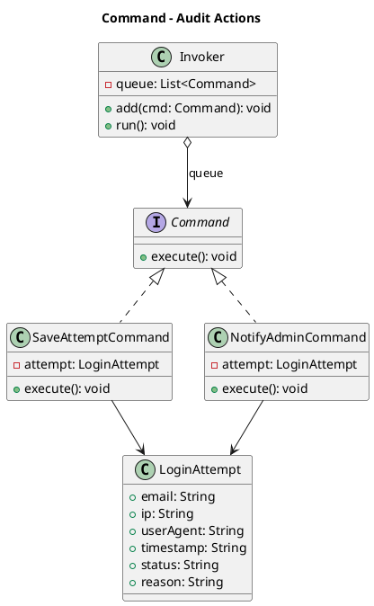

Iterator (recorrer registros del audit sin exponer detalles internos)

Idea: un iterador para recorrer intentos en páginas (o por lote).

```python
class AuditLogIterator:
    def __init__(self, db_path: str, batch_size: int = 50):
        self.db_path = db_path
        self.batch_size = batch_size
        self.offset = 0

    def __iter__(self):
        return self

    def __next__(self):
        conn = sqlite3.connect(self.db_path)
        cur = conn.cursor()
        cur.execute("""
            SELECT email, ip, user_agent, timestamp, status, reason
            FROM login_audit
            ORDER BY timestamp DESC
            LIMIT ? OFFSET ?
        """, (self.batch_size, self.offset))
        rows = cur.fetchall()
        conn.close()

        if not rows:
            raise StopIteration

        self.offset += self.batch_size
        return rows

# Uso:
# for batch in AuditLogIterator(DB_PATH, 20):
#     for row in batch:
#         print(row)

```

```java
import java.util.Iterator;
import java.util.List;

class AuditRecord {
    String email, ip, userAgent, timestamp, status, reason;

    AuditRecord(String email, String ip, String userAgent, String timestamp, String status, String reason) {
        this.email = email; this.ip = ip; this.userAgent = userAgent;
        this.timestamp = timestamp; this.status = status; this.reason = reason;
    }
}

class AuditLogIterator implements Iterator<AuditRecord> {
    private final List<AuditRecord> records;
    private int index = 0;

    AuditLogIterator(List<AuditRecord> records) { this.records = records; }

    @Override public boolean hasNext() { return index < records.size(); }
    @Override public AuditRecord next() { return records.get(index++); }
}

// Uso:
// List<AuditRecord> records = List.of(new AuditRecord(...), new AuditRecord(...));
// Iterator<AuditRecord> it = new AuditLogIterator(records);
// while(it.hasNext()) System.out.println(it.next().email);
```

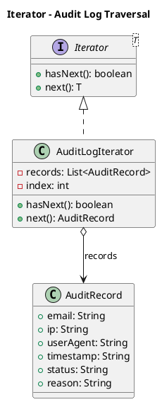

Mediator (coordinar componentes: form → validación → audit → UI)

Idea: el “mediator” coordina sin que los componentes se conozcan entre sí.

```python
class LoginMediator:
    def __init__(self, validator_chain, invoker, db_path):
        self.validator_chain = validator_chain
        self.invoker = invoker
        self.db_path = db_path

    def process_login_attempt(self, email, ip, user_agent):
        attempt = LoginAttempt(email=email, ip=ip, user_agent=user_agent, timestamp="")
        attempt = self.validator_chain.handle(attempt)

        # Siempre registrar (incluso rechazados) para auditoría
        self.invoker.add(SaveAttemptCommand(self.db_path, attempt))

        # Notificar solo si es sospechoso/rechazado, por ejemplo
        if attempt.status == "Rejected":
            self.invoker.add(NotifyAdminCommand(attempt))

        self.invoker.run()
        return attempt

```

```java
class LoginMediator {
    private final Handler validationChain;
    private final Invoker invoker;

    LoginMediator(Handler validationChain, Invoker invoker) {
        this.validationChain = validationChain;
        this.invoker = invoker;
    }

    public LoginAttempt process(String email, String ip, String userAgent) {
        LoginAttempt attempt = new LoginAttempt(email, ip, userAgent);

        attempt = validationChain.handle(attempt);

        // Siempre registrar por auditoría
        invoker.add(new SaveAttemptCommand(attempt));

        // Notificar solo si fue rechazado
        if ("Rejected".equals(attempt.status)) {
            invoker.add(new NotifyAdminCommand(attempt));
        }

        invoker.run();
        return attempt;
    }
}

// Uso:
// Handler chain = new EmailFormatHandler();
// chain.setNext(new BlockedIpHandler()).setNext(new AuditStampHandler());
// LoginMediator mediator = new LoginMediator(chain, new Invoker());
// mediator.process("user@mail.com","1.2.3.4","UA");
```

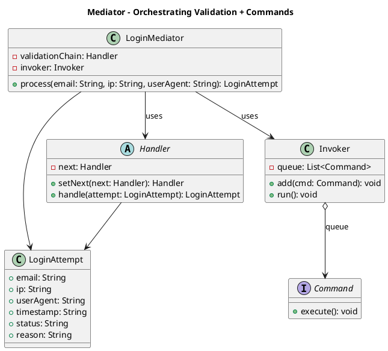

Memento

Guarda y restaura el estado de un objeto sin exponer su implementación. Útil para “deshacer” o volver a un punto previo (por ejemplo, revertir el estado de un intento de login durante evaluación).

```python
from dataclasses import dataclass
from copy import deepcopy

@dataclass
class LoginAttempt:
    email: str
    ip: str
    user_agent: str
    status: str = "Pending"
    reason: str = ""

class AttemptMemento:
    def __init__(self, state: LoginAttempt):
        self._state = deepcopy(state)

    def get_state(self) -> LoginAttempt:
        return deepcopy(self._state)

class AttemptOriginator:
    def __init__(self, attempt: LoginAttempt):
        self.attempt = attempt

    def save(self) -> AttemptMemento:
        return AttemptMemento(self.attempt)

    def restore(self, memento: AttemptMemento):
        self.attempt = memento.get_state()

# Uso:
# origin = AttemptOriginator(LoginAttempt(email="a@b.com", ip="1.2.3.4", user_agent="UA"))
# snap = origin.save()
# origin.attempt.status = "Rejected"
# origin.restore(snap)  # vuelve a Pending

```

Observer

Define una dependencia “uno a muchos”: cuando un sujeto cambia, notifica a sus observadores. Útil para disparar acciones cuando un intento pasa a “Rejected” (alerta, métrica, log).

```python
class Observer:
    def update(self, attempt):
        raise NotImplementedError

class AttemptSubject:
    def __init__(self):
        self._observers = []

    def attach(self, obs: Observer):
        self._observers.append(obs)

    def notify(self, attempt):
        for obs in self._observers:
            obs.update(attempt)

class PrintAlertObserver(Observer):
    def update(self, attempt):
        if attempt.status == "Rejected":
            print(f"[ALERT] Rejected: {attempt.email} from {attempt.ip} ({attempt.reason})")

class MetricsObserver(Observer):
    def __init__(self):
        self.rejected = 0

    def update(self, attempt):
        if attempt.status == "Rejected":
            self.rejected += 1

# Uso:
# subject = AttemptSubject()
# subject.attach(PrintAlertObserver())
# subject.attach(MetricsObserver())
# subject.notify(attempt)

```

State

Permite que un objeto cambie su comportamiento cuando cambia su estado interno. Útil para modelar estados de un intento: Pending → Logged → Rejected, etc.

```python
class AttemptState:
    def handle(self, ctx):
        raise NotImplementedError

class PendingState(AttemptState):
    def handle(self, ctx):
        ctx.attempt.status = "Pending"

class LoggedState(AttemptState):
    def handle(self, ctx):
        ctx.attempt.status = "Logged"

class RejectedState(AttemptState):
    def __init__(self, reason: str):
        self.reason = reason

    def handle(self, ctx):
        ctx.attempt.status = "Rejected"
        ctx.attempt.reason = self.reason

class AttemptContext:
    def __init__(self, attempt):
        self.attempt = attempt
        self.state: AttemptState = PendingState()

    def set_state(self, state: AttemptState):
        self.state = state

    def apply(self):
        self.state.handle(self)

# Uso:
# ctx = AttemptContext(attempt)
# ctx.set_state(RejectedState("Invalid email"))
# ctx.apply()


```

Strategy

Define una familia de algoritmos, los encapsula y los hace intercambiables. Útil para cambiar políticas de validación/riesgo (estricta vs laxa) sin tocar el flujo principal.

```python

import re

class RiskStrategy:
    def evaluate(self, attempt) -> tuple[str, str]:
        raise NotImplementedError

class StrictRiskStrategy(RiskStrategy):
    def evaluate(self, attempt):
        if not re.match(r"[^@]+@[^@]+\.[^@]+", attempt.email):
            return ("Rejected", "Invalid email format")
        if "bot" in (attempt.user_agent or "").lower():
            return ("Rejected", "Suspicious user-agent")
        return ("Logged", "")

class LenientRiskStrategy(RiskStrategy):
    def evaluate(self, attempt):
        if not attempt.email:
            return ("Rejected", "Missing email")
        return ("Logged", "")

class RiskEngine:
    def __init__(self, strategy: RiskStrategy):
        self.strategy = strategy

    def run(self, attempt):
        status, reason = self.strategy.evaluate(attempt)
        attempt.status = status
        attempt.reason = reason
        return attempt

# Uso:
# engine = RiskEngine(StrictRiskStrategy())
# engine.run(attempt)


```

Template Method

Define el esqueleto de un algoritmo en una clase base, dejando algunos pasos a subclases. Útil para estandarizar el pipeline: obtener datos → validar → auditar → notificar.

```python

from datetime import datetime

class AttemptPipelineTemplate:
    def process(self, email, ip, user_agent):
        attempt = self.build_attempt(email, ip, user_agent)
        self.validate(attempt)
        self.audit(attempt)
        self.notify(attempt)
        return attempt

    def build_attempt(self, email, ip, user_agent):
        return LoginAttempt(email=email, ip=ip, user_agent=user_agent, status="Pending", reason="")

    def validate(self, attempt):
        raise NotImplementedError

    def audit(self, attempt):
        # placeholder: aquí iría INSERT a sqlite
        attempt.timestamp = datetime.utcnow().isoformat()

    def notify(self, attempt):
        pass

class StrictAuditPipeline(AttemptPipelineTemplate):
    def validate(self, attempt):
        if "@" not in (attempt.email or ""):
            attempt.status = "Rejected"
            attempt.reason = "Invalid email"

    def notify(self, attempt):
        if attempt.status == "Rejected":
            print(f"[ALERT] {attempt.email} rejected from {attempt.ip}")

# Uso:
# pipeline = StrictAuditPipeline()
# attempt = pipeline.process(email, ip, user_agent)


```


Visitor

Permite añadir operaciones a una estructura de objetos sin modificar sus clases. Útil para aplicar acciones a eventos/objetos de auditoría: exportar, redactar datos, generar reporte.

```python

from dataclasses import dataclass

class Visitor:
    def visit_attempt(self, attempt):
        raise NotImplementedError

@dataclass
class AuditAttempt:
    email: str
    ip: str
    user_agent: str
    timestamp: str
    status: str
    reason: str = ""

    def accept(self, visitor: Visitor):
        return visitor.visit_attempt(self)

class RedactVisitor(Visitor):
    def visit_attempt(self, attempt: AuditAttempt):
        redacted_ip = ".".join(attempt.ip.split(".")[:2] + ["x", "x"]) if attempt.ip else ""
        return {
            "email": attempt.email,
            "ip": redacted_ip,
            "status": attempt.status,
            "timestamp": attempt.timestamp
        }

class CsvRowVisitor(Visitor):
    def visit_attempt(self, attempt: AuditAttempt):
        # fila CSV simple
        return f'{attempt.email},{attempt.ip},{attempt.status},{attempt.timestamp},{attempt.reason}'

# Uso:
# row = audit_attempt.accept(CsvRowVisitor())
# safe = audit_attempt.accept(RedactVisitor())


```


